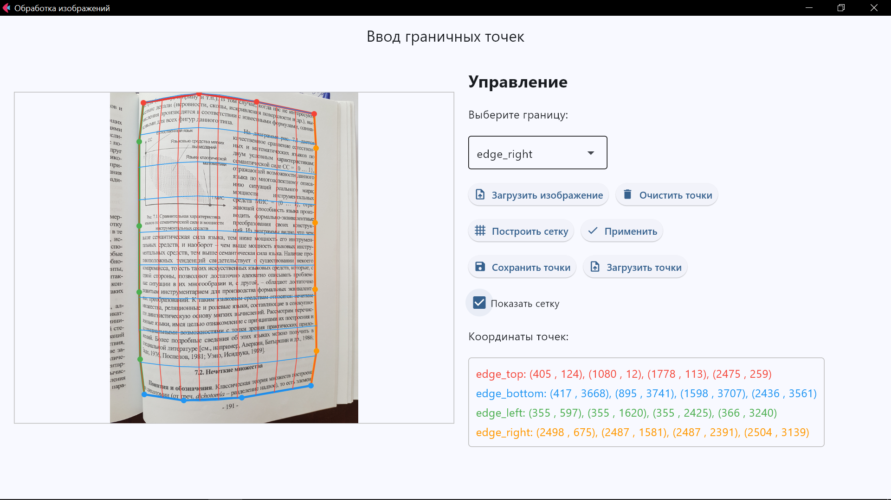
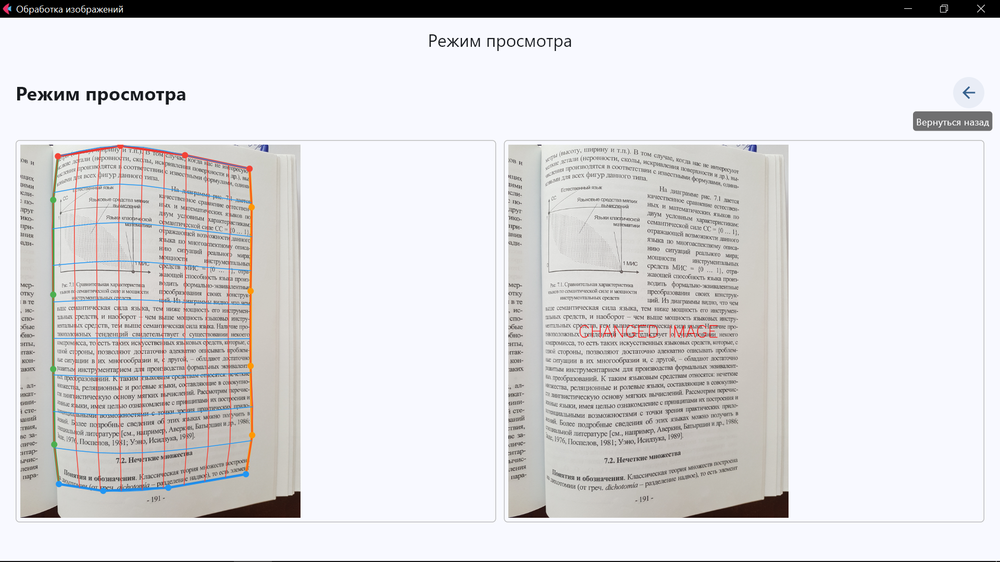

# Text Image Tool

Инструмент для разметки граничных точек области текста на изображении, построения криволинейной сетки, выравнивания и визуализации результатов.

## Быстрый переход

### 📚 Основные разделы
- 📋 [Обзор](#обзор) - что это за инструмент
- 🚀 [Функциональные возможности](#функциональные-возможности) - что умеет делать
- 🔍 [Пример сценария использования](#пример-сценария-использования) - как пользоваться
- 💻 [Установка](#установка) - как запустить

### 🛠️ Техническая информация
- 📁 [Структура проекта](#структура-проекта) - организация файлов
- 🔄 [Взаимодействие компонентов](#взаимодействие-компонентов) - как работает внутри
- ⚙️ [Технические особенности](#технические-особенности) - используемые технологии

### 📌 Дополнительно
- ⚠️ [Ограничения](#ограничения) - известные проблемы
- 📈 [Планы развития](#планы-развития) - будущие улучшения
- 🤝 [Вклад в проект](#вклад-в-проект) - как присоединиться
- 📞 [Контакты](#контакты) - связь с автором

## 📋 Обзор

Text Image Mesh Tool — это десктопное приложение для разметки, анализа и выравнивания изображений с искривлённым текстом. Инструмент позволяет размечать ключевые точки вдоль границ текста, строить по ним криволинейную сетку, выпрямлять искаженный текст и визуализировать результат.


*Главная страница (ввод точек): разметка граничных точек, построение сетки, отображение координат и управление режимами.*


*Режим просмотра: исходное изображение с наложенной криволиненой сеткой (слева) и трансформированное изображение с выровненным текстом (справа).*

## 🚀 Функциональные возможности

- Загрузка изображений (PNG, JPG, JPEG, TIF, TIFF)
- Два режима работы:
  - **Hand** (ручной): для ручного ввода точек и построения сетки
  - **Auto** (автоматический): для автоматической обработки (**_в разработке_**)
- В ручном режиме доступны две вкладки:
  - **Ввод границ**: интерактивная разметка граничных точек
  - **Выравнивание**: отображение сетки и измененного изображения
- Интерактивная разметка граничных точек для 4-х границ (цветовая дифференциация)
- Визуализация введённых точек и координат
- Построение криволинейной сетки по точкам
- **Выравнивание изображений** с искривлённым текстом
- Визуальная индикация процесса обработки с анимацией загрузки
- Включение/отключение отображения сетки
- Сохранение/загрузка разметки в/из JSON (с координатами, путём к изображению, timestamp)
- Удобная навигация между режимами, сохранение состояния

### Сохранение и загрузка
- **Сохранение разметки** в JSON-файл:
```
points.json
```
  ```json
  {
      "points": {
          "edge_top": [[x1, y1], [x2, y2], ...],
          "edge_bottom": [[x1, y1], [x2, y2], ...],
          "edge_left": [[x1, y1], [x2, y2], ...],
          "edge_right": [[x1, y1], [x2, y2], ...]
      },
      "image_path": "путь/к/исходному/изображению",
      "timestamp": "2025-05-11T21:45:00.000Z"
  }
  ```
- **Загрузка сохранённой разметки** с автоматическим восстановлением точек
- **Автоматическое масштабирование координат** между локальным отображением и исходным изображением

## 📁 Структура проекта

```
text-image-tool/
├── app.py             # Точка входа, запуск приложения, маршрутизация страниц
├── core/              # Ядро приложения (математика, построение сетки)
│   ├── utils.py       # Базовые алгоритмы и функции
│   ├── utilsTest.py   # Алгоритмы обработки точек, построение сплайнов
│   ├── grid_utils.py  # Функции работы с сеткой (создание, визуализация, трансформация)
│   └── __init__.py    # Инициализация модуля
├── ui/                # Пользовательский интерфейс (UI)
│   ├── main_page.py   # Страница разметки точек и управления
│   ├── view_page.py   # Страница просмотра и выравнивания изображений
│   ├── auto_page.py   # Страница автоматического режима (в разработке)
│   ├── components/    # UI-компоненты для переиспользования
│   │   ├── file_pickers.py    # Компоненты для выбора файлов
│   │   └── ...                # Другие компоненты
│   ├── handlers/      # Обработчики событий
│   │   ├── picker_handlers.py # Обработчики событий выбора файлов
│   │   └── ...                # Другие обработчики
│   ├── state/         # Управление состоянием приложения
│   │   └── app_state.py       # Класс AppState: точки, границы, флаги, путь к изображению
│   └── utils/         # Вспомогательные функции для UI
├── images/            # Скриншоты для документации
├── storage/           # Временное хранилище обработанных изображений
├── requirements.txt   # Зависимости проекта
├── README.md          # Документация проекта
├── CHANGELOG.md       # История изменений
└── .gitignore         # Исключения для системы контроля версий
```

### 🔄 Взаимодействие компонентов

- `app.py` — связывает страницы, управляет навигацией, инициализирует приложение, переключает между режимами.
- `ui/main_page.py` — реализует страницу ввода граничных точек, обрабатывает добавление и отображение точек.
- `ui/view_page.py` — реализует страницу просмотра и выравнивания, использует grid_utils.py для обработки изображений.
- `ui/auto_page.py` — заготовка для страницы автоматического режима (в разработке).
- `core/utilsTest.py` — содержит функции создания сплайнов и обработки точек, построение меш-функции.
- `core/grid_utils.py` — содержит функции создания координатной сетки, её нормализации, визуализации и применения для трансформации изображений через cv2.remap.
- Компоненты в `ui/components/` — отвечают за элементы пользовательского интерфейса, такие как выбор файлов.
- Обработчики в `ui/handlers/` — содержат логику для обработки пользовательских действий.
- `ui/state/app_state.py` — хранит текущее состояние приложения (точки, выбранная граница, пути к изображениям).

Процесс выравнивания изображения:
1. В `view_page.py` при переключении на вкладку "Выравнивание" вызывается `process_on_tab_change()`
2. Создается координатная сетка с помощью функций из `grid_utils.py`
3. Используя граничные точки из `state.edge_points_lists`, строится функция трансформации через `build_fast_mesh_function()`
4. Визуализируется сетка трансформации с помощью `visualize_grid()` из `grid_utils.py`
5. Вычисляются карты соответствия координат (map_x, map_y) для cv2.remap
6. Выполняется трансформация изображения с помощью `apply_remap()` из `grid_utils.py`
7. Результаты отображаются в пользовательском интерфейсе

## 🔍 Пример сценария использования

1. **Выберите режим работы** в верхних вкладках (Hand или Auto). По умолчанию выбран ручной режим (Hand).
2. **В ручном режиме**:
   - **Вкладка "Ввод границ"**:
     1. **Загрузите изображение** через кнопку "Загрузить изображение".
     2. **Выберите границу** (верх, низ, лево, право) в выпадающем списке.
     3. **Добавьте точки** кликами по изображению (минимум 2 на каждую границу).
     4. **Постройте сетку** — кнопка "Построить сетку". Сетка появится поверх изображения.
     5. **Включите/выключите сетку** чекбоксом "Показать сетку".
     6. **Сохраните разметку** или загрузите ранее сохранённую.
   - **Вкладка "Выравнивание"**:
     - В процессе построения сетки и выравнивания отображается индикатор загрузки.
     - После обработки: слева — исходное изображение с наложенной сеткой, справа — выровненное изображение.
     - Сохраните обработанное изображение через кнопку "Сохранить изображение".

*[См. скриншоты](#обзор) выше для визуального примера интерфейса и работы приложения.*

## 💻 Установка

1. Клонируйте репозиторий:
   ```bash
   git clone https://github.com/trxxnk/text-image-tool.git
   cd text-image-tool
   ```
2. Создайте виртуальное окружение и активируйте его:
   ```bash
   python -m venv venv
   venv\Scripts\activate  # Windows
   # или
   source venv/bin/activate  # Linux/Mac
   ```
3. Установите зависимости:
   ```bash
   pip install -r requirements.txt
   ```
4. Запустите приложение:
   ```bash
   python app.py
   ```

## ⚙️ Технические особенности

- **Фреймворк интерфейса**: Flet (Flutter + Python)
- **Обработка изображений**: OpenCV и NumPy
- **Построение сетки**: 
  - Кубические сплайны (scipy.interpolate.CubicSpline)
  - Естественная параметризация кривых
  - Векторизованные расчёты (numpy)
- **Выравнивание изображений**: 
  - Транзитивная интерполяция для построения координатной сетки
  - Ремаппинг изображений с кубической интерполяцией (cv2.remap)
  - Построение координатной сетки на основе граничных сплайнов
- **Архитектура**: 
  - Модульная структура с разделением логики и представления
  - Отдельные модули для работы с сеткой, UI и обработки изображений
- **Пользовательский опыт**:
  - Индикаторы загрузки и анимации во время обработки
  - Интерактивная визуализация сетки
  - Поэтапное отображение результатов обработки

## ⚠️ Ограничения

- **Web-режим**: В браузере загрузка локальных изображений может не работать из-за ограничений доступа. Рекомендуется использовать десктопную версию.
- **Точность сетки**: Качество построенной сетки зависит от количества и расположения точек.
- **Обработка введенных точек**: Верхние угловые точки должны быть занесены в `edge_top`, аналогично нижние угловые точки в `edge_bottom`. Необходимо реализовать более умную систему обработки введенных точек.
- **Подсказки, уведомления, исключительные ситуации**: В коде предусмотрены некоторые простые обработчики исключительных ситуаций, однако в большинстве случаев информация об ошибках не выводится пользователю.
- **Автоматический режим**: Находится в стадии разработки и пока недоступен для использования.
- **Излишки кода**: не самая удачная структура проекта, неиспользуемые части кода. 

## 📈 Планы развития

- Реализация автоматического режима обработки, пакетная обработка изображений
- Редактирование точек (удаление, перемещение)
- Рефактоинг кода, упрощение структуры проекта и компонентов 

## 🤝 Вклад в проект

Приветствуются предложения по улучшению и исправлению ошибок! Для внесения изменений:
1. Создайте форк репозитория
2. Создайте ветку для ваших изменений (`git checkout -b feature/amazing-feature`)
3. Зафиксируйте изменения (`git commit -m 'Add some amazing feature'`)
4. Отправьте изменения в ваш форк (`git push origin feature/amazing-feature`)
5. Создайте Pull Request

## 📞 Контакты

При возникновении вопросов или предложений, пожалуйста, создайте Issue в репозитории проекта. 