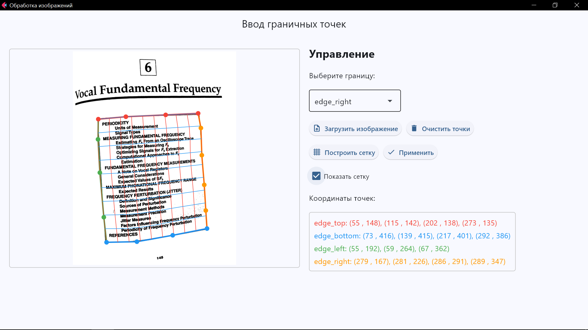
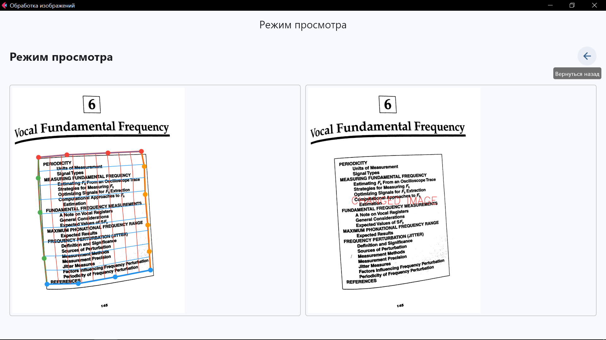

# Text Image Mesh Tool

Инструмент для разметки граничных точек на изображениях с текстом, построения криволинейной сетки и визуализации результатов.

## Обзор

Text Image Mesh Tool — это десктопное приложение, разработанное для помощи в анализе и обработке изображений с искривленным текстом. Инструмент позволяет размечать ключевые точки вдоль границ текста, строить на их основе криволинейную сетку и визуализировать результаты.




## Функциональные возможности

### Работа с изображениями
- **Загрузка изображений** различных форматов (PNG, JPG, JPEG, TIF, TIFF)
- **Цветовая дифференциация** границ для удобной разметки
- **Водяные знаки** на обработанных изображениях для визуального отличия

### Разметка и визуализация
- **Интерактивное добавление точек** для четырёх границ:
  - Верхняя граница (красный)
  - Нижняя граница (синий) 
  - Левая граница (зелёный)
  - Правая граница (оранжевый)
- **Отображение координат** всех введённых точек
- **Построение криволинейной сетки** по граничным точкам
- **Настраиваемая визуализация сетки** (возможность включения/отключения)

### Сохранение и загрузка
- **Сохранение разметки** в JSON-файл:
  ```json
  {
      "points": {
          "edge_top": [[x1, y1], [x2, y2], ...],
          "edge_bottom": [[x1, y1], [x2, y2], ...],
          "edge_left": [[x1, y1], [x2, y2], ...],
          "edge_right": [[x1, y1], [x2, y2], ...]
      },
      "image_path": "путь/к/исходному/изображению",
      "timestamp": "2025-05-11T21:45:00.000Z"
  }
  ```
- **Загрузка сохранённой разметки** с автоматическим восстановлением точек
- **Автоматическое масштабирование координат** между локальным отображением и исходным изображением

### Интерфейс
- **Два режима работы**:
  - Режим разметки - для добавления точек и построения сетки
  - Режим просмотра - для сравнения исходного и обработанного изображений
- **Интуитивное управление** с иконками и подсказками
- **Удобная навигация** между режимами с сохранением состояния

## Структура проекта

```
text-image-tool/
├── app.py             # Основной файл приложения
├── core/              # Ядро приложения
│   └── utils.py       # Утилиты для построения сетки
├── ui/                # Пользовательский интерфейс
│   ├── main_page.py   # Страница ввода точек
│   └── view_page.py   # Страница просмотра
├── images/            # Изображения для документации
└── storage/           # Временное хранилище
```

## Установка

### Требования
- Python 3.8 или выше
- Pip (менеджер пакетов Python)

### Шаги установки

1. **Клонирование репозитория**
   ```bash
   git clone https://github.com/trxxnk/text-image-tool.git
   cd text-image-tool
   ```

2. **Создание виртуального окружения**
   ```bash
   python -m venv venv
   ```

3. **Активация виртуального окружения**
   - Windows:
     ```bash
     venv\Scripts\activate
     ```
   - Linux/Mac:
     ```bash
     source venv/bin/activate
     ```

4. **Установка зависимостей**
   ```bash
   pip install -r requirements.txt
   ```

## Использование

### Запуск приложения
```bash
python app.py
```

### Базовый рабочий процесс

1. **Загрузка изображения**
   - Нажмите кнопку "Загрузить изображение" и выберите файл

2. **Разметка граничных точек**
   - Выберите нужную границу из выпадающего списка
   - Кликайте по изображению для добавления точек
   - Минимум 2 точки для каждой границы обязательны

3. **Построение сетки**
   - Нажмите кнопку "Построить сетку" после добавления точек
   - Используйте чекбокс для отображения/скрытия сетки

4. **Просмотр результатов**
   - Нажмите кнопку "Применить" для перехода в режим просмотра
   - Слева отображается исходное изображение с сеткой
   - Справа отображается изображение с водяным знаком
   - Используйте кнопку "Назад" для возврата к редактированию

5. **Сохранение и загрузка**
   - Используйте кнопку "Сохранить точки" для сохранения разметки
   - Используйте кнопку "Загрузить точки" для восстановления разметки
   - При загрузке необходимо наличие исходного изображения

## Технические особенности

- **Фреймворк интерфейса**: Flet (Flutter + Python)
- **Обработка изображений**: OpenCV и NumPy
- **Построение сетки**: Кубические сплайны и векторизованные расчеты
- **Архитектура**: Модульная структура с разделением логики и представления

## Ограничения

- **Web-режим**: В браузере загрузка локальных изображений может не работать из-за ограничений доступа. Рекомендуется использовать десктопную версию.
- **Производительность**: При работе с очень большими изображениями возможны задержки, работа программы с большими изображениями не проверялась.
- **Точность сетки**: Качество построенной сетки зависит от количества и расположения размеченных точек.

## Планы развития

- **Редактирование точек**: Добавление возможности удаления и перемещения отдельных точек
- **Алгоритм выпрямления**: Реализация алгоритма трансформации изображения для выпрямления искривленного текста
- **Пакетная обработка**: Возможность обработки нескольких изображений
- **Настройка параметров сетки**: Изменение плотности линий и других параметров

## Вклад в проект

Приветствуются предложения по улучшению и исправлению ошибок! Для внесения изменений:
1. Создайте форк репозитория
2. Создайте ветку для ваших изменений (`git checkout -b feature/amazing-feature`)
3. Зафиксируйте изменения (`git commit -m 'Add some amazing feature'`)
4. Отправьте изменения в ваш форк (`git push origin feature/amazing-feature`)
5. Создайте Pull Request

## Контакты

При возникновении вопросов или предложений, пожалуйста, создайте Issue в репозитории проекта. 