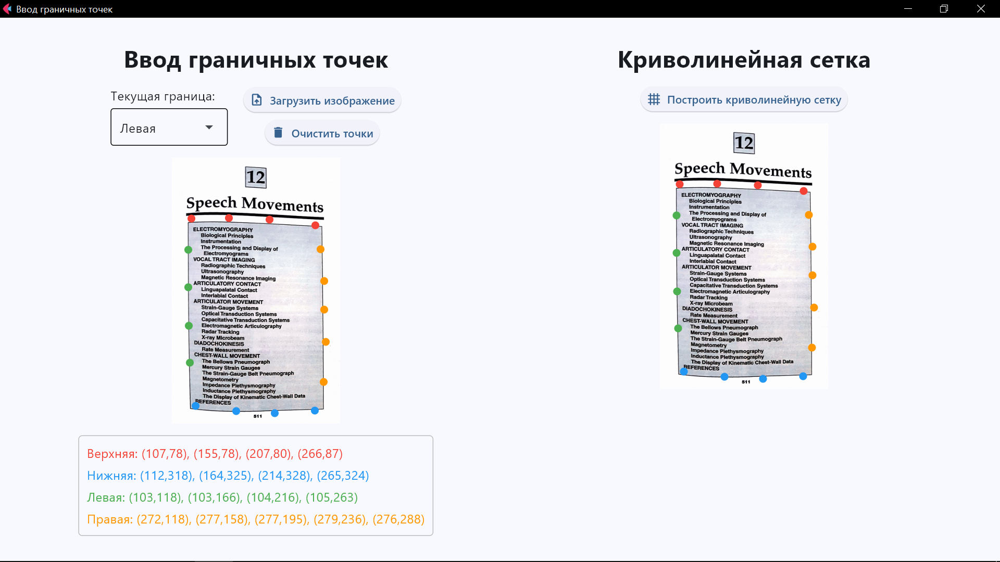

# Text Image Processing Tool

Инструмент для разметки граничных точек на изображениях с текстом. Позволяет загружать изображение, отмечать граничные точки для каждой из четырёх границ (верхняя, нижняя, левая, правая), просматривать координаты введённых точек и визуализировать их на дублированном изображении.

---

## Интерфейс



---

## Текущий функционал

- Загрузка изображения через диалоговое окно.
- Адаптивный интерфейс с двумя панелями:
  - **Левая панель**:  
    - Выбор текущей границы (верхняя, нижняя, левая, правая) через выпадающее меню.
    - Кнопки "Загрузить изображение" и "Очистить точки".
    - Отметка точек на изображении кликом мыши.
    - Отображение координат введённых точек для каждой границы.
  - **Правая панель**:  
    - Кнопка "Построить криволинейную сетку" (пока отображает только введённые точки).
    - Дублированное изображение с отображением всех введённых точек.
- Автоматическое масштабирование изображений и интерфейса под размер окна.
- Очистка всех точек одной кнопкой.
- Автоматическое удаление точек при загрузке нового изображения.

---

## Известные ограничения

- **Web-режим (запуск в браузере):**  
  При запуске приложения как web-сайта (через браузер) изображения, загруженные с локального диска, не отображаются. Это связано с тем, что браузер не имеет доступа к локальным файлам напрямую.  
  **Решение:** Для корректной работы в web-режиме требуется реализовать загрузку изображений через base64 data URL или хранение файлов на сервере с доступом по URL. В текущей версии корректная работа гарантируется только при запуске как desktop-приложения.

---

## Планируемая функциональность

- Построение и отображение настоящей криволинейной сетки по введённым граничным точкам (вместо текущего отображения только точек).
- Коррекция яркости изображения.
- Визуализация выделенной области.

---

## Установка

1. Создайте виртуальное окружение:
    ```bash
    python -m venv venv
    ```

2. Активируйте виртуальное окружение:
    - Windows:
        ```bash
        venv\Scripts\activate
        ```
    - Linux/Mac:
        ```bash
        source venv/bin/activate
        ```

3. Установите зависимости:
    ```bash
    pip install -r requirements.txt
    ```

---

## Запуск

```bash
python web/main.py
```

---

## Обратная связь и доработка

Если у вас есть предложения по улучшению или вы нашли ошибку — создайте issue или отправьте pull request! 